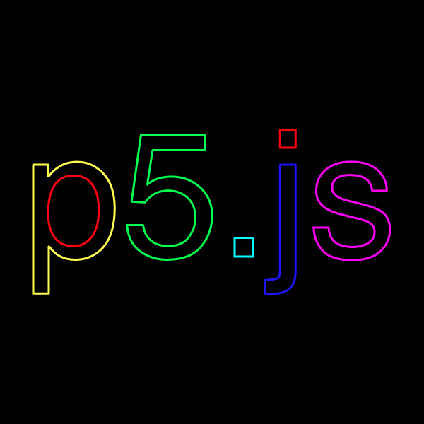

# p5.textToLoops
Applies basic logic to textToPoints that allows more intelligent organization of vertices.



## Usage
```js
new p5(p => {

    let font;

    p.preload = _ => { font = p.loadFont('assets/helvetica.ttf'); };

    p.setup = _ => {
        let fntSz = 250;
        let str = 'p5.js';

        p.createCanvas(600, 600);
        p.pixelDensity(1);
        p.background(0);

        p.translate(p.width / 2, p.height / 2);

        p.colorMode(p.HSB);
        p.noFill();
        p.strokeWeight(3);

        p.textSize(fntSz);
        p.textFont(font);

        let bounds = font.textBounds(str, 0, 0);
        p.translate(-bounds.w / 2, bounds.h / 2 - 50);

        let loops = p.textToLoops(str, font, fntSz, {
            simplifyThreshold: 0,
            sampleFactor: 0.8
        }).loops;

        loops.forEach((loop, i) => {
            p.stroke((i / (loops.length - 1)) * 360, 100, 100);
            p.beginShape();
            loop.forEach(e => p.vertex(e.x, e.y));
            p.endShape();
        });
    };
});
```

# Development
$ npm run start

# Build
$ npm run build
